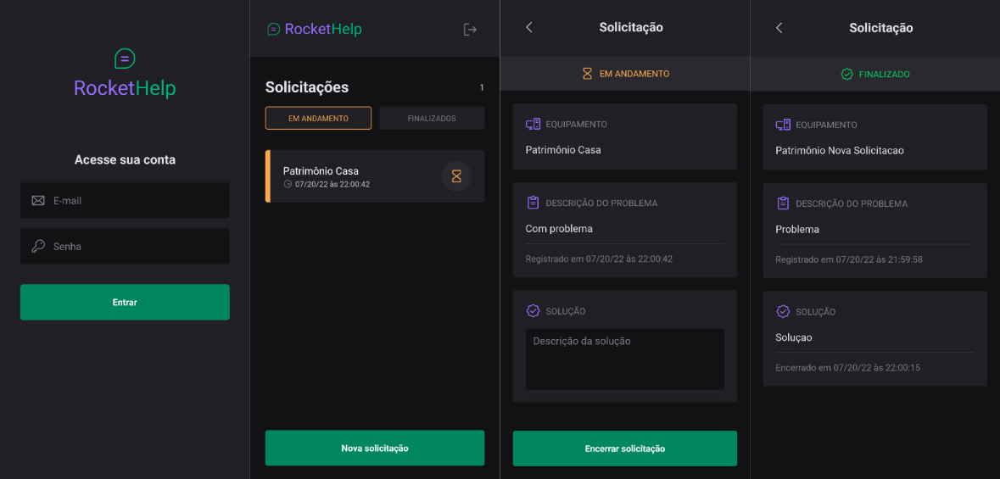

<p align="center">
  <a href="#project">Project</a>&nbsp;&nbsp;&nbsp;|&nbsp;&nbsp;&nbsp;
  <a href="#technologies">Technologies</a>&nbsp;&nbsp;&nbsp;|&nbsp;&nbsp;&nbsp;
  <a href="#contribute">Contribute</a>&nbsp;&nbsp;&nbsp;|&nbsp;&nbsp;&nbsp;
  <a href="#license">MIT License</a>
</p>

## Project

**Rockethelp** is an app for creating support tickets. Created for study purposes with React Native and Expo, during <a href="https://www.rocketseat.com.br/" target="_blank">Rocketseat's</a> Ignite Lab Program.

<p style="text-align: center">
  
</p>


### Installation

The app was created using Expo bare workflow, which allows us to use native and managed components. Check the <a href="https://docs.expo.dev/introduction/managed-vs-bare/#bare-workflow" target="_blank">Expo docs</a> to know more about the different types of workflows. 

To run this project you will need: 

- Install <a href="https://docs.expo.dev/get-started/installation/" target="_blank">Expo CLI</a>.
- Install <a href="https://docs.expo.dev/workflow/ios-simulator/" target="_blank">iOS</a> or <a href="https://docs.Expo.dev/workflow/android-studio-emulator/" target="_blank">Android</a> emulator</a>. Rocketseat has a nice <a href="https://react-native.rocketseat.dev/" target="_blank">guide</a> for this (Brazilian Portuguese only).
- <a href="https://firebase.google.com/" target="_blank">Firebase</a> account with <a href="https://firebase.google.com/docs/auth" target="_blank">Authentication</a> and <a href="https://firebase.google.com/docs/firestore" target="_blank">Firestore</a> services.
- Register your app with Firebase (<a href="https://firebase.google.com/docs/ios/setup" target="_blank">iOS</a> / <a href="https://firebase.google.com/docs/android/setup" target="_blank">Android</a>). At the final of the register process, download GoogleService-Info.plist (iOS) and google-services.json (Android) files and add them to the root folder.
- Fill ./app.json file with your project data.
- Next, you need to use the `expo prebuild --clean` command described in the <a href="https://docs.expo.dev/workflow/customizing/" target="_blank">"Adding custom native code"<a/> guide to rebuild your app.

### Getting Started

- Install dependencies

```bash
expo install
```

- Open android or iOS emulator
- Start Metro Bundler
```bash
npm run start
```

- Start the app
```bash
npm run android
npm run ios
```

If you encounter problems running Expo native modules or Firebase, you can find updated information at <a href="https://docs.expo.dev/workflow/customizing/" target="_blank">Expo</a> or <a href="https://rnfirebase.io/#expo" target="_blank">React Native Firebase</a> docs.

## Technologies

<table>
  <tbody>
    <tr>
        <td>Expo</td>
        <td>TypeScript</td>      
        <td>Firebase</td>
    </tr>
    <tr>
        <td>React Native</td>
        <td>React Navigation</td>
        <td>Nativebase (UI)</td>
    </tr>
  </tbody>
</table>

## Contribute

- Fork this repository
- Create a branch with your feature: `git checkout -b my-feature`
- Commit your changes: `git commit -m 'feat: add my new feature'`
- Push it to your branch: `git push origin my-feature`

After merging your pull request, your branch can be deleted.

Check the details about the types, verbs and commit messages here [CONTRIBUTING.md](./.github/CONTRIBUTING.md)

Also check the [CODE_OF_CONDUCT.md](./.github/CODE_OF_CONDUCT.md)

## License

This project is [MIT Licensed](./LICENSE)
